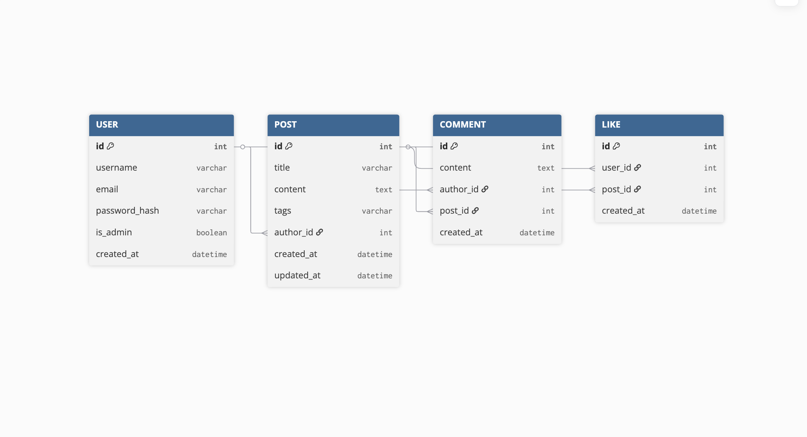
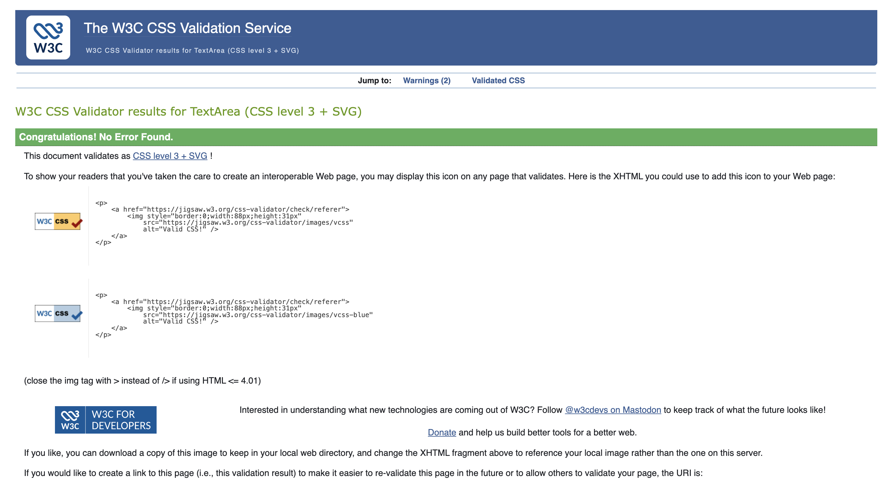
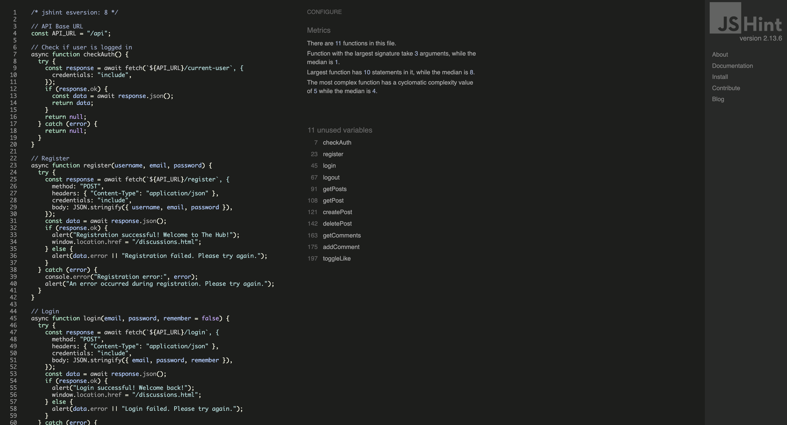

A modern, discussion platform where users can share ideas, engage in conversations, and build a community.

🔗 Live Site: http://13.49.238.130

## Introduction

**The Hub** is a discussion-based blog platform designed to facilitate meaningful conversations on topics that matter. Users can create posts, comment on discussions, like content, and search through topics of interest.

The platform features role-based access control with admin capabilities for content moderation.

### Key Features

- **User Authentication** - Secure registration and login system with password hashing
- **Post Creation** - Rich text discussions with tagging functionality
- **Add Tags** - Rich text discussions with tagging functionality
- **Comments System** - commenting on all posts
- **Like System** - Engage with content through likes
- **Search Functionality** - search discussions by title, content, or tags
- **Admin Panel** - Administrative controls for content moderation
- **Responsive Design** - Mobile-friendly interface with modern UI/UX

### Technologies Used

**Backend:**

- Python
- Flask 3.0.0
- PostgreSQL (AlwaysData)
- SQLAlchemy (ORM)

**Frontend:**

- HTML5
- CSS

**Deployment:**

- AWS
# 🎨 UI/UX Design

### Design Philosophy
The Hub embraces a clean, minimalist aesthetic with a focus on readability and user engagement. The design prioritizes content while maintaining visual appeal through subtle decorative elements and a warm color palette.

### Color Palette
- **Primary Background:** `#FFF8F0` (Warm cream)
- **Text Primary:** `#2C1810` (Dark brown)
- **Accent Color:** `#8B4513` (Saddle brown)
- **Interactive Elements:** `#FF6B35` (Orange)
- **Admin Actions:** `#DC3545` (Red)

### Typography
- **Headings:** Georgia, serif
- **Body Text:** -apple-system, system-ui (System fonts for optimal performance)
- **Emphasis on readability** with appropriate line heights and letter spacing

### Key Design Elements
- **Decorative Corner Ornaments** - Unique visual identity on headers
- **Card-based Layout** - Clean separation of content
- **Responsive Grid System** - Adapts seamlessly across devices
- **Visual Feedback** - Hover states, loading indicators, and success messages

### User Experience Considerations
- **Fast Load Times** - Optimized assets and minimal dependencies
- **Accessibility** - Semantic HTML and proper contrast ratios
- **Clear Hierarchy** - Visual weight guides user attention
- **Consistent Patterns** - Familiar UI patterns reduce cognitive load

---

## 👥 User Stories

### As a First-Time Visitor
- I want to see the latest discussions on the homepage so I can gauge the community's interests
- I want to easily understand what the platform offers so I can decide if I want to join
- I want a simple registration process so I can quickly become a member

### As a Registered User
- I want to create posts with titles, content, and tags so I can share my thoughts with the community
- I want to comment on other users' posts so I can engage in discussions
- I want to like posts that resonate with me so I can show appreciation
- I want to search for specific topics so I can find relevant discussions
- I want to see how many people have engaged with my posts (likes and comments)
- I want my session to persist so I don't have to log in repeatedly

### As an Administrator
- I want to delete any post that violates community guidelines so I can maintain platform quality
- I want clear visual indicators of my admin status so I know when I'm using admin powers
- I want to view all users posts so I can moderate effectively
- I want confirmation prompts before deleting content to prevent accidental removals

### As a Content Creator
- I want my posts to be searchable by tags so others can discover my content
- I want to edit my posts after publishing to correct mistakes or add information

---

**Database structure**

**Automated testing**

